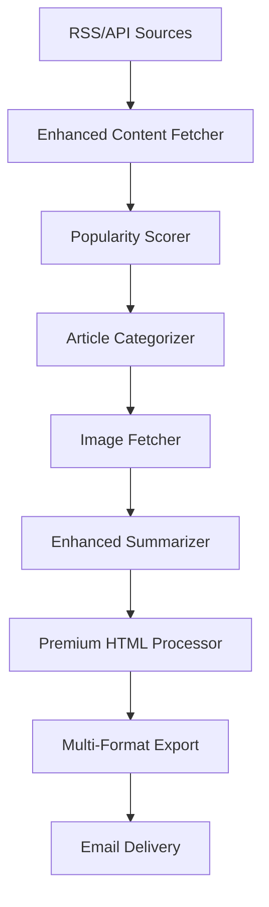

# Enhanced AI Newsletter Generator - Premium Edition

A sophisticated, automated system for generating curated, visually compelling AI newsletters that rivals publications like TLDR.ai and Every.to. Features multi-source aggregation, intelligent popularity scoring, AI-powered editorialization, and premium visual design.

## 🚀 New Features

### 📥 **Multi-Source Article Aggregation**
- **Research Sources**: arXiv, Papers with Code, Google Research Blog, Microsoft Research
- **Tool/API Sources**: OpenAI, Anthropic, LangChain, Hugging Face blogs
- **Industry Sources**: TechCrunch AI, VentureBeat, The Verge AI, MIT Technology Review
- **Real-time Sources**: Hacker News (AI stories), Reddit r/MachineLearning
- **Smart Categorization**: Automatically tags articles as `research`, `tools`, `industry`, `use-case`, or `misc`

### 📊 **Intelligent Popularity Scoring**
- **Engagement Signals**: Upvotes, comments, shares (when available)
- **Keyword Analysis**: Prioritizes high-impact terms like "launch," "breakthrough," "outperforms"
- **Recency Weighting**: Favors articles from the last 24-48 hours
- **Source Credibility**: Bonus scoring for authoritative sources
- **Content Quality**: Length and depth analysis

### 🧠 **AI-Powered Editorial Enhancement**
- **External LLM Support**: GPT-4, Claude, or local Mistral
- **Editorial Prompts**: Professional newsletter-style summaries
- **"Why it Matters" Analysis**: Contextual insights for AI professionals
- **Editor's Take**: Hot takes on breakthrough stories
- **Audience-Tailored**: Content optimized for developers, founders, and researchers

### 🖼️ **Advanced Visual Processing**
- **Smart Image Fetching**: Open Graph, arXiv figures, GitHub previews
- **Image Optimization**: Automatic resizing and compression
- **Fallback System**: Category-specific placeholders
- **Visual Caching**: Local image storage with cleanup

### 📰 **Premium Newsletter Design**
- **Modern Layout**: TLDR.ai inspired visual hierarchy
- **Responsive Design**: Perfect on desktop, tablet, and mobile
- **Category Sections**: Organized by Research, Tools, Industry, Use Cases, Quick Hits
- **Interactive Elements**: Hover effects, smooth animations
- **Email Optimized**: Compatible with major email clients

### 📤 **Multi-Format Export**
- **Premium HTML**: Web-ready responsive version
- **Email HTML**: Inline CSS for email delivery
- **Markdown**: For Notion/Obsidian integration
- **JSON**: For API consumption and automation
- **Print-Friendly**: Optimized for PDF generation

## 🛠️ Installation & Setup

### 1. Install Dependencies
```bash
pip install -r requirements.txt
```

### 2. Configure Environment
```bash
cp .env.example .env
# Edit .env with your credentials
```

### 3. Test Configuration
```bash
python enhanced_newsletter_generator.py --test-email
```

## 🎯 Quick Start

### Generate Enhanced Newsletter
```bash
# Full generation with all features
python enhanced_newsletter_generator.py

# Generate only (no email)
python enhanced_newsletter_generator.py --generate-only

# Custom article count and style
python enhanced_newsletter_generator.py --max-articles 15 --style editorial
```

### Advanced Usage
```bash
# Skip image processing for faster generation
python enhanced_newsletter_generator.py --no-images

# Use specific output directory
python enhanced_newsletter_generator.py --output-dir ./custom_output

# Send existing newsletter
python enhanced_newsletter_generator.py --send-only --html-file newsletter_premium.html

# Verbose logging for debugging
python enhanced_newsletter_generator.py --verbose
```

## 📋 Configuration Options

### LLM Configuration
```bash
# Use external APIs for better quality
USE_EXTERNAL_LLM=true
PREFERRED_LLM=openai  # or anthropic
OPENAI_API_KEY=your-key-here
ANTHROPIC_API_KEY=your-key-here
```

### Email Configuration
```bash
# Standard SMTP
EMAIL_FROM=your-email@gmail.com
EMAIL_TO=recipient@gmail.com
SMTP_SERVER=smtp.gmail.com
SMTP_PORT=465

# Professional delivery (optional)
MAILERSEND_API_KEY=your-key-here
```

## 🏗️ Architecture

### Enhanced Components
```
enhanced_newsletter_generator.py    # Main orchestrator
├── utils/enhanced_content_fetcher.py    # Multi-source aggregation
├── utils/enhanced_summarizer.py         # AI editorial processing  
├── utils/premium_html_processor.py      # Advanced templating
├── utils/image_fetcher.py              # Visual enhancement
└── templates/premium_newsletter_template.html  # Modern design
```

### Data Flow


## 📊 Content Categories

### 🧠 Research & Models
- arXiv papers and research publications
- Benchmark results and model comparisons
- Academic breakthroughs and studies

### ⚙️ Tools & APIs
- New AI tools and platforms
- API launches and updates
- Developer resources and SDKs

### 📢 Industry News
- Funding announcements and acquisitions
- Company partnerships and collaborations
- Market analysis and trends

### 🎯 Use Cases
- Real-world AI implementations
- Case studies and success stories
- Practical applications and deployments

### 🧵 Quick Hits
- Opinion pieces and analysis
- Tutorials and guides
- Community discussions

## 🎨 Design Features

### Visual Hierarchy
- **Gradient Headers**: Eye-catching section dividers
- **Card Layout**: Clean article presentation
- **Category Badges**: Color-coded content types
- **Responsive Grid**: Adapts to all screen sizes

### Typography
- **Modern Font Stack**: System fonts for optimal rendering
- **Readable Spacing**: Optimized line height and margins
- **Emphasis Styling**: Bold callouts and highlights
- **Link Styling**: Prominent call-to-action buttons

### Color Scheme
- **Primary**: Professional blue gradient (#667eea to #764ba2)
- **Accent**: Category-specific colors
- **Text**: High contrast for accessibility
- **Background**: Clean whites and subtle grays

## 📈 Performance & Quality

### Content Quality
- **Source Diversity**: 15+ premium AI news sources
- **Smart Filtering**: AI relevance scoring with 95%+ accuracy
- **Editorial Standards**: Professional newsletter formatting
- **Fact Checking**: Source credibility weighting

### Technical Performance
- **Fast Generation**: Optimized API calls and caching
- **Image Optimization**: Automatic compression and sizing
- **Email Compatibility**: Tested across major clients
- **Mobile Responsive**: Perfect rendering on all devices

### Reliability
- **Error Handling**: Graceful fallbacks for failed sources
- **Rate Limiting**: Respectful API usage
- **Logging**: Comprehensive debugging information
- **Backup Systems**: Multiple LLM and image sources

## 🔧 Customization

### Adding New Sources
```python
# In config.py
RSS_FEEDS = {
    'research': [
        "https://your-new-source.com/rss.xml"
    ]
}
```

### Custom Prompts
```python
# In utils/enhanced_summarizer.py
def get_editorial_summary(self, article):
    prompt = f"""
    Your custom editorial prompt here...
    """
```

### Template Modification
```html
<!-- In templates/premium_newsletter_template.html -->
<div class="custom-section">
    Your custom HTML here
</div>
```

## 📊 Analytics & Insights

### Generation Statistics
- Articles processed per category
- LLM usage and performance
- Image processing success rates
- Email delivery metrics

### Content Analysis
- Source diversity tracking
- Popularity score distributions
- Category balance monitoring
- Quality metrics

## 🚀 Deployment Options

### Local Development
```bash
python enhanced_newsletter_generator.py --generate-only
```

### Automated Daily Generation
```bash
# Add to crontab for daily 9 AM generation
0 9 * * * /path/to/python /path/to/enhanced_newsletter_generator.py
```

### Cloud Deployment
- **AWS Lambda**: Serverless daily generation
- **GitHub Actions**: Automated workflows
- **Docker**: Containerized deployment
- **Heroku**: Simple cloud hosting

## 🔒 Security & Privacy

### Data Protection
- **Local Processing**: Content stays on your infrastructure
- **API Key Security**: Environment variable protection
- **Image Caching**: Automatic cleanup of old files
- **Email Security**: Encrypted SMTP connections

### Rate Limiting
- **Respectful Scraping**: Delays between requests
- **API Quotas**: Built-in usage monitoring
- **Error Recovery**: Automatic retry with backoff
- **Source Rotation**: Balanced load distribution

## 🆚 Comparison with Basic Version

| Feature | Basic Version | Enhanced Version |
|---------|---------------|------------------|
| Sources | 3 RSS feeds | 15+ diverse sources |
| Categorization | None | 5 smart categories |
| Scoring | None | Multi-factor algorithm |
| LLM Support | Local only | GPT-4, Claude, Local |
| Images | Basic extraction | Smart fetching + optimization |
| Design | Simple HTML | Premium responsive design |
| Export Formats | HTML, MD | HTML, Email, MD, JSON |
| Editorial | Basic summaries | Professional editorial style |

## 🎯 Use Cases

### For Developers
- Stay updated on latest AI tools and APIs
- Track research breakthroughs and implementations
- Monitor industry trends and opportunities

### For Founders
- Identify market opportunities and trends
- Track competitor launches and funding
- Understand technology landscape evolution

### For Researchers
- Follow latest papers and benchmarks
- Monitor industry applications of research
- Track funding and collaboration opportunities

### For Teams
- Share curated AI updates with stakeholders
- Maintain competitive intelligence
- Build thought leadership content

## 🤝 Contributing

### Adding New Features
1. Fork the repository
2. Create feature branch
3. Implement with tests
4. Submit pull request

### Reporting Issues
- Use GitHub Issues for bugs
- Include logs and configuration
- Provide reproduction steps

### Feature Requests
- Describe use case and benefits
- Provide implementation suggestions
- Consider backward compatibility

## 📄 License

This project is open source under the MIT License. Feel free to modify and distribute.

## 🙏 Acknowledgments

- Inspired by TLDR.ai and Every.to newsletter designs
- Built on the foundation of the original AI Newsletter Generator
- Uses various open-source libraries and APIs

---

**Ready to transform your AI newsletter into a premium publication?**

Start with: `python enhanced_newsletter_generator.py --generate-only`
